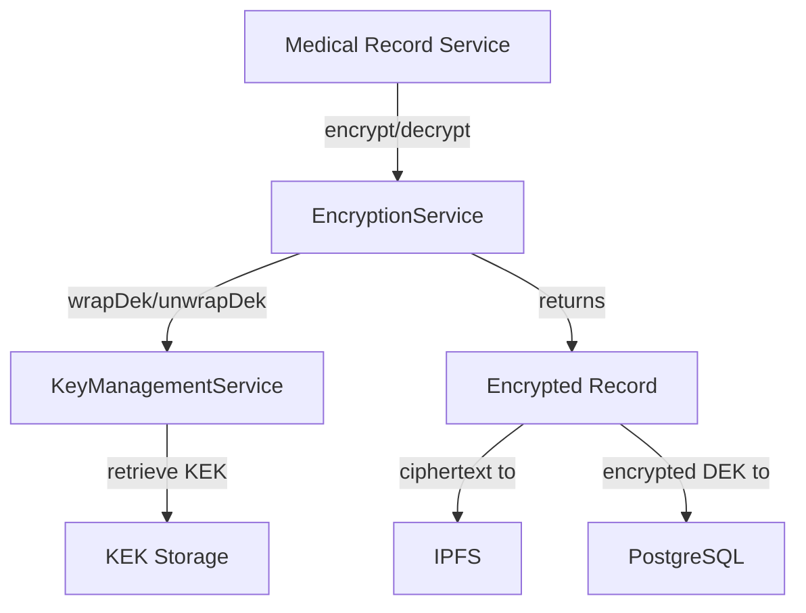
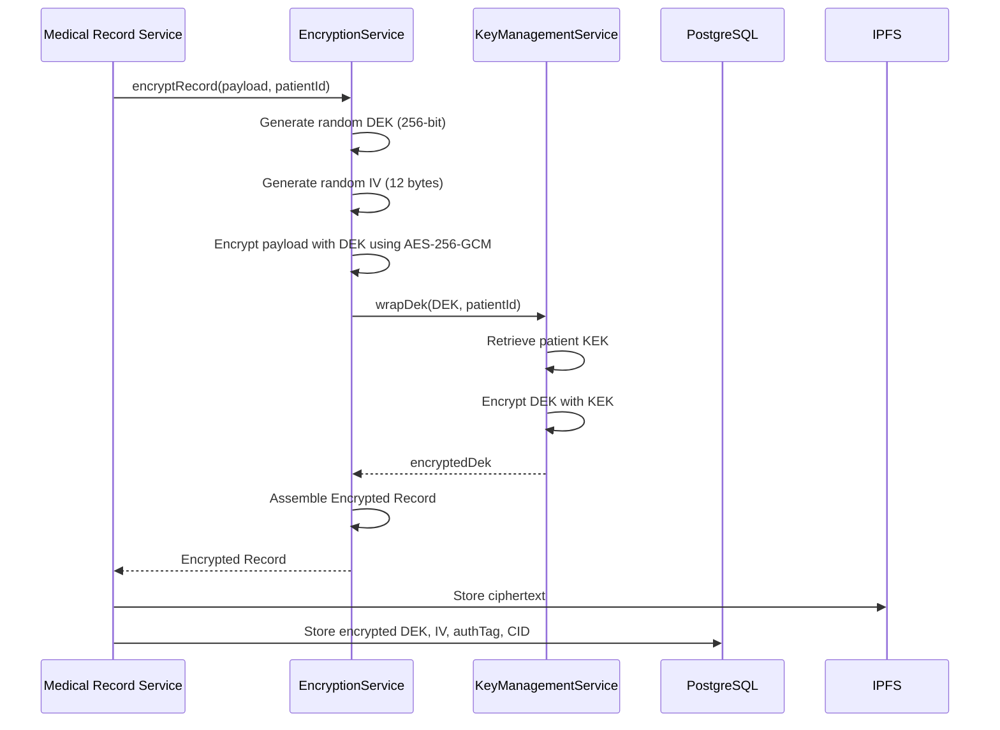
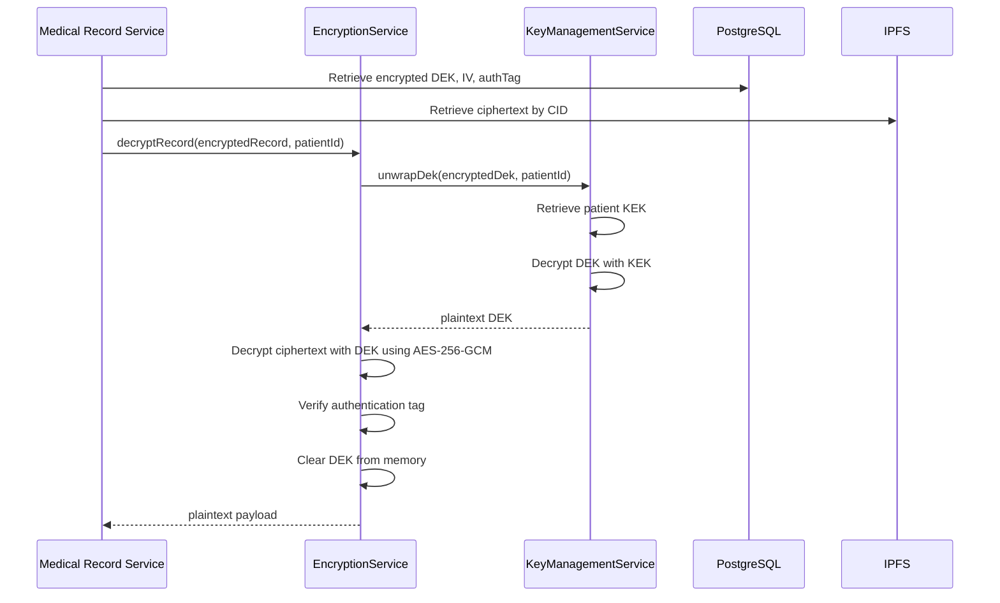

# Design Document: Envelope Encryption for Medical Records

## Overview

This design implements envelope encryption for medical record payloads in a NestJS healthcare application. The system uses a two-tier key hierarchy: each medical record is encrypted with a unique Data Encryption Key (DEK), and each DEK is encrypted with a patient-specific Key Encryption Key (KEK) managed by a Key Management Service.

The architecture ensures that:
- Each medical record has a unique encryption key (DEK isolation)
- Patient-specific KEKs provide access control boundaries
- Encrypted payloads are stored on IPFS
- Encrypted DEKs are stored in PostgreSQL (never on IPFS or blockchain)
- KEKs never leave the KMS
- AES-256-GCM provides authenticated encryption

This design addresses the requirements for secure medical record storage with cryptographic separation between patients and records.

## Architecture

### System Components

The envelope encryption system consists of three primary components:

1. **EncryptionService**: The main service that orchestrates encryption and decryption operations
2. **KeyManagementService**: Manages KEKs and performs DEK wrapping/unwrapping operations
3. **Encrypted Record Structure**: The data format that bundles all components needed for decryption

### Component Relationships



### Encryption Flow



### Decryption Flow



### Module Structure

The encryption functionality is encapsulated in a NestJS module with strict dependency boundaries:

```typescript
@Module({
  providers: [
    EncryptionService,
    {
      provide: KeyManagementService,
      useClass: KeyManagementService,
    },
  ],
  exports: [EncryptionService], // Only EncryptionService is exported
})
export class EncryptionModule {}
```

This ensures that KeyManagementService is only accessible through EncryptionService, enforcing the security boundary specified in Requirement 8.

## Components and Interfaces

### EncryptionService

The primary service responsible for all encryption and decryption operations.

**Interface:**

```typescript
@Injectable()
export class EncryptionService {
  constructor(private readonly kms: KeyManagementService) {}

  /**
   * Encrypts a medical record payload using envelope encryption
   * @param payload - The medical record data to encrypt
   * @param patientId - The patient identifier for KEK selection
   * @returns Promise resolving to an EncryptedRecord structure
   */
  async encryptRecord(payload: Buffer, patientId: string): Promise<EncryptedRecord>;

  /**
   * Decrypts a medical record using the encrypted DEK
   * @param encryptedRecord - The encrypted record structure
   * @param patientId - The patient identifier for KEK selection
   * @returns Promise resolving to the plaintext payload
   */
  async decryptRecord(encryptedRecord: EncryptedRecord, patientId: string): Promise<Buffer>;
}
```

**Implementation Details:**

The `encryptRecord` method:
1. Generates a 256-bit DEK using `crypto.randomBytes(32)`
2. Generates a 12-byte IV using `crypto.randomBytes(12)`
3. Creates an AES-256-GCM cipher with the DEK and IV
4. Encrypts the payload and extracts the authentication tag
5. Calls `kms.wrapDek(dek, patientId)` to encrypt the DEK
6. Assembles and returns the EncryptedRecord structure
7. Clears the plaintext DEK from memory

The `decryptRecord` method:
1. Calls `kms.unwrapDek(encryptedRecord.encryptedDek, patientId)` to obtain the plaintext DEK
2. Creates an AES-256-GCM decipher with the DEK and IV
3. Sets the authentication tag for verification
4. Decrypts the ciphertext
5. Throws an error if authentication tag verification fails
6. Clears the plaintext DEK from memory
7. Returns the plaintext payload

### KeyManagementService

The service responsible for managing KEKs and performing DEK wrapping/unwrapping.

**Interface:**

```typescript
@Injectable()
export class KeyManagementService {
  /**
   * Encrypts a DEK using the patient's KEK
   * @param dek - The plaintext Data Encryption Key
   * @param patientId - The patient identifier for KEK selection
   * @returns Promise resolving to the encrypted DEK
   */
  async wrapDek(dek: Buffer, patientId: string): Promise<Buffer>;

  /**
   * Decrypts a DEK using the patient's KEK
   * @param encryptedDek - The encrypted Data Encryption Key
   * @param patientId - The patient identifier for KEK selection
   * @returns Promise resolving to the plaintext DEK
   */
  async unwrapDek(encryptedDek: Buffer, patientId: string): Promise<Buffer>;

  /**
   * Retrieves the current DEK version identifier
   * @param patientId - The patient identifier
   * @returns The version string for the current DEK encryption scheme
   */
  getDekVersion(patientId: string): string;
}
```

**Implementation Details:**

The KeyManagementService maintains a mapping of patient IDs to KEKs. In a production system, this would integrate with a hardware security module (HSM) or cloud KMS (AWS KMS, Azure Key Vault, Google Cloud KMS). For this design:

- KEKs are 256-bit AES keys
- KEKs are retrieved based on patientId
- DEK wrapping uses AES-256-GCM with a unique IV per wrap operation
- The wrapped DEK includes the IV and authentication tag
- DEK version tracking supports future key rotation

### EncryptedRecord Interface

The data structure that contains all components necessary for decryption.

```typescript
export interface EncryptedRecord {
  /**
   * The initialization vector used for AES-256-GCM encryption (12 bytes)
   */
  iv: Buffer;

  /**
   * The encrypted medical record payload
   */
  ciphertext: Buffer;

  /**
   * The authentication tag produced by AES-256-GCM (16 bytes)
   */
  authTag: Buffer;

  /**
   * The DEK encrypted with the patient's KEK
   */
  encryptedDek: Buffer;

  /**
   * The version identifier for the DEK encryption scheme
   */
  dekVersion: string;
}
```

**Storage Distribution:**

- `ciphertext`: Stored on IPFS, referenced by CID
- `iv`, `authTag`, `encryptedDek`, `dekVersion`: Stored in PostgreSQL
- The CID linking to the ciphertext is also stored in PostgreSQL

This separation ensures that:
- The encrypted DEK never appears on public storage (IPFS or blockchain)
- The ciphertext alone is useless without the encrypted DEK
- All decryption components are available when authorized

## Data Models

### PostgreSQL Schema

```sql
CREATE TABLE medical_records (
  id UUID PRIMARY KEY DEFAULT gen_random_uuid(),
  patient_id VARCHAR(255) NOT NULL,
  ipfs_cid VARCHAR(255) NOT NULL,
  encrypted_dek BYTEA NOT NULL,
  iv BYTEA NOT NULL,
  auth_tag BYTEA NOT NULL,
  dek_version VARCHAR(50) NOT NULL,
  created_at TIMESTAMP DEFAULT CURRENT_TIMESTAMP,
  updated_at TIMESTAMP DEFAULT CURRENT_TIMESTAMP,
  
  INDEX idx_patient_id (patient_id),
  INDEX idx_ipfs_cid (ipfs_cid)
);
```

### Key Storage

KEKs are stored in a secure key storage system (HSM or cloud KMS). The schema for KEK metadata:

```sql
CREATE TABLE patient_keks (
  patient_id VARCHAR(255) PRIMARY KEY,
  kek_id VARCHAR(255) NOT NULL,
  kek_version VARCHAR(50) NOT NULL,
  created_at TIMESTAMP DEFAULT CURRENT_TIMESTAMP,
  rotated_at TIMESTAMP,
  
  INDEX idx_kek_id (kek_id)
);
```

Note: The actual KEK material is stored in the KMS, not in this table. This table only stores metadata for KEK identification and rotation tracking.

### Cryptographic Parameters

| Parameter | Value | Justification |
|-----------|-------|---------------|
| DEK Algorithm | AES-256-GCM | Authenticated encryption, industry standard |
| DEK Size | 256 bits (32 bytes) | Maximum AES key size for future-proofing |
| KEK Algorithm | AES-256-GCM | Consistent with DEK encryption |
| KEK Size | 256 bits (32 bytes) | Maximum AES key size |
| IV Size | 12 bytes (96 bits) | Recommended size for GCM mode |
| Auth Tag Size | 16 bytes (128 bits) | Default GCM authentication tag size |
| Random Source | crypto.randomBytes | Cryptographically secure PRNG |


## Correctness Properties

A property is a characteristic or behavior that should hold true across all valid executions of a system—essentially, a formal statement about what the system should do. Properties serve as the bridge between human-readable specifications and machine-verifiable correctness guarantees.

### Property 1: Encryption/Decryption Round-Trip

For any medical record payload and patient ID, encrypting the payload and then decrypting the resulting encrypted record should produce the original payload.

**Validates: Requirements 3.4, 7.2, 7.3, 7.5**

### Property 2: Unique Data Encryption Keys

For any set of encryption operations, all generated DEKs should be unique (no two encryption operations should produce the same DEK).

**Validates: Requirements 2.2**

### Property 3: Unique Initialization Vectors

For any set of encryption operations, all generated IVs should be unique (no two encryption operations should produce the same IV).

**Validates: Requirements 3.5, 10.2, 10.3**

### Property 4: Encrypted Record Structure Completeness

For any encryption operation, the resulting encrypted record should contain all required fields: iv (Buffer), ciphertext (Buffer), authTag (Buffer), encryptedDek (Buffer), and dekVersion (string), with all fields being non-null and non-empty.

**Validates: Requirements 4.4, 5.6, 10.4, 14.1**

### Property 5: Cryptographic Parameter Sizes

For any encryption operation, the generated DEK should be exactly 32 bytes (256 bits) and the generated IV should be exactly 12 bytes (96 bits).

**Validates: Requirements 2.1, 3.2, 10.1**

### Property 6: Authentication Tag Verification

For any encrypted record with corrupted ciphertext or authentication tag, attempting to decrypt should throw an error indicating data corruption or tampering.

**Validates: Requirements 7.4, 11.1**

### Property 7: Invalid Encrypted DEK Handling

For any encrypted record with an invalid or corrupted encrypted DEK, attempting to decrypt should throw an error indicating the DEK cannot be unwrapped.

**Validates: Requirements 11.2**

### Property 8: DEK Version Population

For any encryption operation, the resulting encrypted record should have a non-empty dekVersion field.

**Validates: Requirements 14.2**

### Property 9: KMS Wrap/Unwrap Round-Trip

For any plaintext DEK and patient ID, wrapping the DEK with the patient's KEK and then unwrapping it should produce the original DEK.

**Validates: Requirements 13.4**


## Error Handling

The encryption service implements comprehensive error handling to ensure security and reliability:

### Encryption Errors

**DEK Generation Failure:**
- Cause: Insufficient entropy or system resource issues
- Handling: Throw `EncryptionError` with message "Failed to generate DEK"
- Recovery: Caller should retry or escalate to system administrator

**KMS Wrap Failure:**
- Cause: KEK not found for patient, KMS unavailable, or network issues
- Handling: Throw `KeyManagementError` with message "Failed to wrap DEK for patient {patientId}"
- Recovery: Verify patient KEK exists, check KMS connectivity

**Cipher Creation Failure:**
- Cause: Invalid algorithm parameters or crypto library issues
- Handling: Throw `EncryptionError` with message "Failed to create cipher"
- Recovery: Verify Node.js crypto module is available

### Decryption Errors

**KMS Unwrap Failure:**
- Cause: Invalid encrypted DEK, wrong patient KEK, or KMS unavailable
- Handling: Throw `KeyManagementError` with message "Failed to unwrap DEK for patient {patientId}"
- Recovery: Verify encrypted DEK integrity, check patient authorization

**Authentication Tag Verification Failure:**
- Cause: Ciphertext tampered with, wrong DEK, or corrupted data
- Handling: Throw `AuthenticationError` with message "Authentication tag verification failed - data may be corrupted or tampered"
- Recovery: Do not retry - investigate potential security incident, verify data integrity

**Decipher Creation Failure:**
- Cause: Invalid IV, wrong algorithm, or crypto library issues
- Handling: Throw `DecryptionError` with message "Failed to create decipher"
- Recovery: Verify IV integrity and format

**Malformed Encrypted Record:**
- Cause: Missing required fields or invalid field types
- Handling: Throw `ValidationError` with message "Invalid encrypted record structure"
- Recovery: Verify data retrieval from storage is correct

### Error Hierarchy

```typescript
export class EncryptionServiceError extends Error {
  constructor(message: string) {
    super(message);
    this.name = 'EncryptionServiceError';
  }
}

export class EncryptionError extends EncryptionServiceError {
  constructor(message: string) {
    super(message);
    this.name = 'EncryptionError';
  }
}

export class DecryptionError extends EncryptionServiceError {
  constructor(message: string) {
    super(message);
    this.name = 'DecryptionError';
  }
}

export class AuthenticationError extends DecryptionError {
  constructor(message: string) {
    super(message);
    this.name = 'AuthenticationError';
  }
}

export class KeyManagementError extends EncryptionServiceError {
  constructor(message: string) {
    super(message);
    this.name = 'KeyManagementError';
  }
}

export class ValidationError extends EncryptionServiceError {
  constructor(message: string) {
    super(message);
    this.name = 'ValidationError';
  }
}
```

### Security Considerations

**Error Message Safety:**
- Error messages should not leak sensitive information (plaintext, keys, or key material)
- Error messages should provide enough context for debugging without compromising security
- Failed decryption attempts should be logged for security auditing

**Memory Safety:**
- Plaintext DEKs should be cleared from memory immediately after use
- Use `Buffer.fill(0)` to overwrite sensitive data before garbage collection
- Avoid logging or serializing sensitive buffers

**Timing Attack Mitigation:**
- Authentication tag verification should use constant-time comparison where possible
- Error responses should not vary in timing based on the type of failure

## Testing Strategy

The encryption service requires comprehensive testing using both unit tests and property-based tests to ensure correctness and security.

### Dual Testing Approach

**Unit Tests:**
- Verify specific examples and edge cases
- Test error conditions and exception handling
- Validate integration points with KeyManagementService
- Test specific scenarios like empty payloads, large files, and boundary conditions

**Property-Based Tests:**
- Verify universal properties across all inputs
- Use randomized input generation to test a wide range of scenarios
- Ensure properties hold for at least 100 iterations per test
- Catch edge cases that might not be considered in unit tests

Both testing approaches are complementary and necessary for comprehensive coverage. Unit tests catch concrete bugs and verify specific behaviors, while property-based tests verify general correctness across the input space.

### Property-Based Testing Configuration

**Library Selection:**
- Use `fast-check` for TypeScript/JavaScript property-based testing
- Install: `npm install --save-dev fast-check @types/fast-check`

**Test Configuration:**
- Minimum 100 iterations per property test (configured via `fc.assert` options)
- Each property test must reference its design document property using a comment tag
- Tag format: `// Feature: envelope-encryption-medical-records, Property {number}: {property_text}`

**Example Property Test Structure:**

```typescript
import * as fc from 'fast-check';

describe('EncryptionService Property Tests', () => {
  // Feature: envelope-encryption-medical-records, Property 1: Encryption/Decryption Round-Trip
  it('should decrypt to original payload for any input', async () => {
    await fc.assert(
      fc.asyncProperty(
        fc.uint8Array({ minLength: 1, maxLength: 10000 }),
        fc.string({ minLength: 1, maxLength: 100 }),
        async (payloadArray, patientId) => {
          const payload = Buffer.from(payloadArray);
          const encrypted = await encryptionService.encryptRecord(payload, patientId);
          const decrypted = await encryptionService.decryptRecord(encrypted, patientId);
          expect(decrypted.equals(payload)).toBe(true);
        }
      ),
      { numRuns: 100 }
    );
  });
});
```

### Unit Test Coverage

**Successful Operations:**
- Encrypt a small payload (< 1KB)
- Encrypt a medium payload (1MB)
- Encrypt a large payload (10MB)
- Decrypt a previously encrypted payload
- Round-trip with various patient IDs

**Error Conditions:**
- Decrypt with corrupted ciphertext
- Decrypt with corrupted authentication tag
- Decrypt with corrupted IV
- Decrypt with invalid encrypted DEK
- Decrypt with wrong patient ID
- Encrypt with empty payload (edge case)
- Decrypt with missing fields in encrypted record

**Integration Tests:**
- Verify KeyManagementService is called with correct parameters
- Verify DEK is wrapped before being included in encrypted record
- Verify DEK is unwrapped before decryption
- Verify dekVersion is obtained from KMS and included in encrypted record

**Security Tests:**
- Verify DEKs are unique across multiple encryptions
- Verify IVs are unique across multiple encryptions
- Verify DEK size is 32 bytes
- Verify IV size is 12 bytes
- Verify authentication tag is 16 bytes
- Verify plaintext DEK is not logged or exposed in errors

### Property Test Mapping

Each correctness property from the design document must be implemented as a property-based test:

1. **Property 1 (Round-Trip)**: Generate random payloads and patient IDs, verify encrypt then decrypt returns original
2. **Property 2 (Unique DEKs)**: Generate multiple encrypted records, extract encrypted DEKs, verify all are unique
3. **Property 3 (Unique IVs)**: Generate multiple encrypted records, extract IVs, verify all are unique
4. **Property 4 (Structure Completeness)**: Generate random payloads, verify all fields present and non-empty
5. **Property 5 (Parameter Sizes)**: Generate random payloads, verify DEK is 32 bytes and IV is 12 bytes
6. **Property 6 (Auth Tag Verification)**: Generate random encrypted records, corrupt data, verify decryption throws
7. **Property 7 (Invalid DEK Handling)**: Generate random encrypted records, corrupt encrypted DEK, verify decryption throws
8. **Property 8 (DEK Version)**: Generate random payloads, verify dekVersion is non-empty string
9. **Property 9 (KMS Round-Trip)**: Generate random DEKs and patient IDs, verify wrap then unwrap returns original

### Performance Testing

While not part of correctness testing, performance should be validated:

**Benchmark Tests:**
- Measure encryption time for 10MB payload (target: < 250ms)
- Measure decryption time for 10MB payload (target: < 250ms)
- Measure combined round-trip time (target: < 500ms per Requirement 9.1)
- Run benchmarks on representative hardware
- Log performance metrics for monitoring

**Performance Test Implementation:**

```typescript
describe('EncryptionService Performance', () => {
  it('should encrypt and decrypt 10MB within 500ms', async () => {
    const payload = Buffer.alloc(10 * 1024 * 1024); // 10MB
    const patientId = 'test-patient';
    
    const startTime = Date.now();
    const encrypted = await encryptionService.encryptRecord(payload, patientId);
    const decrypted = await encryptionService.decryptRecord(encrypted, patientId);
    const endTime = Date.now();
    
    const duration = endTime - startTime;
    console.log(`Round-trip time: ${duration}ms`);
    expect(duration).toBeLessThan(500);
  });
});
```

### Test Coverage Goals

- Line coverage: ≥ 90% for EncryptionService
- Branch coverage: ≥ 85% for EncryptionService
- Function coverage: 100% for public methods
- Property test iterations: ≥ 100 per property

### Continuous Integration

All tests (unit and property-based) should run on every commit:
- Run unit tests first (faster feedback)
- Run property-based tests (more comprehensive but slower)
- Run performance benchmarks on main branch only
- Fail build if any test fails or coverage drops below threshold

