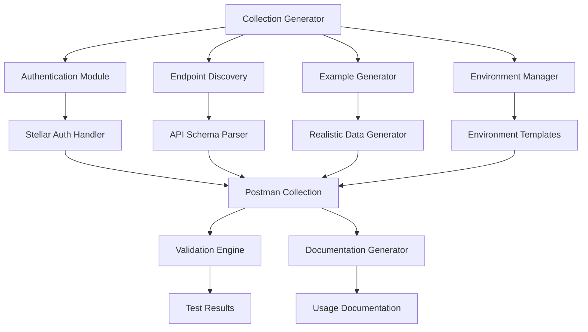

# Postman API Collection Design Document

## Overview

The Postman API Collection feature provides a comprehensive, automated solution for creating and maintaining Postman collections that cover Stellar blockchain API endpoints. This system generates collections with proper authentication, environment configurations, realistic examples, and validation testing capabilities.

The solution addresses the need for developers to quickly test and integrate with Stellar APIs by providing pre-configured collections that include authentication flows, comprehensive endpoint coverage, and realistic usage scenarios.

## Architecture

### High-Level Architecture



### Component Architecture

The system follows a modular architecture with clear separation of concerns:

1. **Collection Generator**: Core orchestration component
2. **Authentication Module**: Handles Stellar-specific authentication
3. **Endpoint Discovery**: Analyzes API schemas and discovers endpoints
4. **Example Generator**: Creates realistic request/response examples
5. **Environment Manager**: Manages different environment configurations
6. **Validation Engine**: Tests collection functionality
7. **Documentation Generator**: Creates usage documentation

## Components and Interfaces

### Collection Generator

**Purpose**: Orchestrates the entire collection generation process

**Interface**:
```typescript
interface CollectionGenerator {
  generateCollection(config: CollectionConfig): Promise<PostmanCollection>
  updateCollection(collection: PostmanCollection, updates: CollectionUpdate[]): Promise<PostmanCollection>
  validateCollection(collection: PostmanCollection): Promise<ValidationResult>
}

interface CollectionConfig {
  apiBaseUrl: string
  authConfig: AuthenticationConfig
  environments: EnvironmentConfig[]
  includeEndpoints: string[]
  excludeEndpoints: string[]
  generateExamples: boolean
  includeTests: boolean
}
```

### Authentication Module

**Purpose**: Handles Stellar blockchain authentication mechanisms

**Interface**:
```typescript
interface AuthenticationModule {
  generateAuthFlow(authType: StellarAuthType): AuthFlow
  createAuthPreRequest(): PreRequestScript
  validateAuthCredentials(credentials: AuthCredentials): Promise<boolean>
}

interface StellarAuthType {
  type: 'keypair' | 'jwt' | 'oauth'
  network: 'testnet' | 'mainnet'
  requiresSignature: boolean
}

interface AuthFlow {
  preRequestScript: string
  authHeaders: Record<string, string>
  environmentVariables: Record<string, string>
}
```

### Endpoint Discovery

**Purpose**: Discovers and categorizes API endpoints from Stellar services

**Interface**:
```typescript
interface EndpointDiscovery {
  discoverEndpoints(apiSpec: OpenAPISpec): Promise<EndpointInfo[]>
  categorizeEndpoints(endpoints: EndpointInfo[]): EndpointCategory[]
  generateRequestTemplates(endpoint: EndpointInfo): RequestTemplate
}

interface EndpointInfo {
  path: string
  method: HttpMethod
  category: string
  description: string
  parameters: Parameter[]
  responses: ResponseSchema[]
  authRequired: boolean
}
```

### Example Generator

**Purpose**: Creates realistic examples for API requests and responses

**Interface**:
```typescript
interface ExampleGenerator {
  generateRequestExample(endpoint: EndpointInfo): RequestExample
  generateResponseExample(responseSchema: ResponseSchema): ResponseExample
  createUsageScenario(endpoints: EndpointInfo[]): UsageScenario
}

interface RequestExample {
  headers: Record<string, string>
  queryParams: Record<string, any>
  body: any
  description: string
}
```

### Environment Manager

**Purpose**: Manages different environment configurations (testnet, mainnet, local)

**Interface**:
```typescript
interface EnvironmentManager {
  createEnvironment(config: EnvironmentConfig): PostmanEnvironment
  updateEnvironment(env: PostmanEnvironment, updates: EnvironmentUpdate): PostmanEnvironment
  validateEnvironment(env: PostmanEnvironment): Promise<ValidationResult>
}

interface EnvironmentConfig {
  name: string
  baseUrl: string
  networkPassphrase: string
  horizonUrl: string
  stellarCoreUrl?: string
  authCredentials: AuthCredentials
}
```

## Data Models

### Core Data Models

```typescript
// Postman Collection Structure
interface PostmanCollection {
  info: CollectionInfo
  item: CollectionItem[]
  auth?: AuthDefinition
  event?: Event[]
  variable?: Variable[]
}

interface CollectionInfo {
  name: string
  description: string
  version: string
  schema: string
}

interface CollectionItem {
  name: string
  description?: string
  request: Request
  response?: Response[]
  event?: Event[]
}

// Stellar-specific Models
interface StellarEndpoint {
  service: 'horizon' | 'stellar-core' | 'soroban-rpc'
  category: 'accounts' | 'transactions' | 'operations' | 'ledgers' | 'payments' | 'contracts'
  endpoint: EndpointInfo
  examples: StellarExample[]
}

interface StellarExample {
  scenario: string
  requestData: any
  expectedResponse: any
  testAssertions: string[]
}

// Environment Models
interface StellarEnvironment {
  network: 'testnet' | 'mainnet' | 'futurenet'
  horizonUrl: string
  networkPassphrase: string
  friendbotUrl?: string
  sorobanRpcUrl?: string
  credentials: {
    publicKey?: string
    secretKey?: string
    jwtToken?: string
  }
}
```

### Authentication Models

```typescript
interface AuthCredentials {
  type: 'keypair' | 'jwt' | 'oauth'
  publicKey?: string
  secretKey?: string
  token?: string
  expiresAt?: Date
}

interface AuthFlow {
  preRequestScript: string
  testScript?: string
  headers: Record<string, string>
  environmentVars: Record<string, string>
}
```

## Correctness Properties

*A property is a characteristic or behavior that should hold true across all valid executions of a system-essentially, a formal statement about what the system should do. Properties serve as the bridge between human-readable specifications and machine-verifiable correctness guarantees.*

### Property Reflection

After analyzing the acceptance criteria, I identified several properties that can be consolidated:

- Properties 1.1 (Collection structure) and 1.6 (Documentation) can be combined into a comprehensive collection completeness property
- Properties 1.2 (Endpoint coverage) and 1.7 (Realistic scenarios) can be combined since realistic scenarios inherently require proper endpoint coverage
- Properties 1.3 (Authentication) and 1.9 (Security) overlap significantly and can be consolidated into a security-focused authentication property
- Properties 1.5 (Validation testing) and 1.10 (Performance testing) can remain separate as they test different aspects
- Properties 1.4 (Environment configurations) and 1.8 (Maintenance processes) can remain separate as they address different concerns

### Property 1: Collection Completeness and Structure

*For any* API specification and collection configuration, the generated Postman collection should contain all required structural elements including properly organized folders, complete documentation, usage instructions, and descriptive metadata for all items.

**Validates: Requirements 1.1, 1.6**

### Property 2: Comprehensive Endpoint Coverage with Realistic Examples

*For any* Stellar API specification, the generated collection should include all specified endpoints with realistic examples that use valid Stellar data structures, proper parameter values, and authentic usage scenarios.

**Validates: Requirements 1.2, 1.7**

### Property 3: Secure Authentication Configuration

*For any* authentication configuration, the generated collection should properly implement Stellar authentication flows without exposing sensitive credentials, using environment variables appropriately, and following security best practices.

**Validates: Requirements 1.3, 1.9**

### Property 4: Environment Configuration Completeness

*For any* target network (testnet, mainnet, futurenet), the generated environment should contain all required variables with correct values specific to that network including URLs, network passphrases, and network-specific configurations.

**Validates: Requirements 1.4**

### Property 5: Validation Test Coverage

*For any* generated collection request, appropriate test scripts should be included that validate response structure, status codes, and Stellar-specific response data according to the API specification.

**Validates: Requirements 1.5**

### Property 6: Collection Update Consistency

*For any* collection update operation, the updated collection should maintain consistency with the original structure while incorporating all specified changes without breaking existing functionality.

**Validates: Requirements 1.8**

### Property 7: Performance Test Integration

*For any* collection that includes performance testing requirements, appropriate performance test scripts should be generated that measure response times and validate performance characteristics within acceptable thresholds.

**Validates: Requirements 1.10**

## Error Handling

### Authentication Errors

**Invalid Credentials**: When authentication credentials are invalid or expired, the system should:
- Provide clear error messages indicating the authentication failure
- Suggest remediation steps (e.g., check credentials, refresh tokens)
- Fail gracefully without exposing sensitive information

**Network Authentication Failures**: When network-specific authentication fails:
- Validate network configuration against known Stellar networks
- Provide network-specific troubleshooting guidance
- Support fallback authentication methods where applicable

### API Discovery Errors

**Invalid API Specifications**: When API specifications are malformed or incomplete:
- Validate OpenAPI/Swagger specifications before processing
- Provide detailed error messages about specification issues
- Support partial collection generation for valid portions

**Endpoint Access Errors**: When endpoints are unreachable during validation:
- Implement retry mechanisms with exponential backoff
- Distinguish between temporary and permanent failures
- Generate collections with appropriate error handling in tests

### Collection Generation Errors

**Template Generation Failures**: When request templates cannot be generated:
- Provide fallback templates for common patterns
- Log detailed error information for debugging
- Continue processing other endpoints when possible

**Environment Configuration Errors**: When environment setup fails:
- Validate environment variables and URLs
- Provide clear guidance on required configurations
- Support environment-specific error recovery

### Validation Errors

**Collection Validation Failures**: When generated collections fail validation:
- Provide detailed validation reports
- Identify specific items that failed validation
- Support incremental fixes and re-validation

**Test Execution Errors**: When validation tests fail:
- Capture and report test execution details
- Distinguish between collection issues and API issues
- Provide debugging information for test failures

## Testing Strategy

### Dual Testing Approach

The testing strategy employs both unit testing and property-based testing to ensure comprehensive coverage:

**Unit Tests**: Focus on specific examples, edge cases, and integration points
- Authentication flow with specific credential types
- Collection generation for known API specifications
- Environment configuration for specific Stellar networks
- Error handling for specific failure scenarios

**Property Tests**: Verify universal properties across all inputs
- Collection structure consistency across different API specifications
- Authentication security across all credential types
- Environment completeness across all network configurations
- Validation coverage across all endpoint types

### Property-Based Testing Configuration

**Testing Library**: Use `fast-check` for JavaScript/TypeScript property-based testing
**Test Configuration**: Minimum 100 iterations per property test
**Test Tagging**: Each property test references its design document property

Example test tags:
- **Feature: postman-api-collection, Property 1: Collection completeness and structure**
- **Feature: postman-api-collection, Property 2: Comprehensive endpoint coverage with realistic examples**
- **Feature: postman-api-collection, Property 3: Secure authentication configuration**

### Unit Testing Focus Areas

**Specific Examples**:
- Generate collection for Stellar Horizon API specification
- Create testnet environment with known configuration
- Authenticate using Ed25519 keypair
- Validate account endpoint response structure

**Edge Cases**:
- Empty API specifications
- Missing authentication credentials
- Invalid network configurations
- Malformed endpoint responses

**Integration Points**:
- Postman collection import/export
- Environment variable resolution
- Authentication token refresh
- API specification parsing

### Test Data Management

**Realistic Test Data**: Use actual Stellar network data structures for testing
**Environment Isolation**: Separate test environments for different Stellar networks
**Credential Management**: Secure handling of test credentials and keys
**API Mocking**: Mock Stellar API responses for consistent testing

### Performance Testing

**Collection Generation Performance**: Measure time to generate collections of various sizes
**Authentication Performance**: Test authentication flow execution times
**Validation Performance**: Measure collection validation execution time
**Memory Usage**: Monitor memory consumption during large collection generation

### Continuous Testing

**Automated Testing**: Run tests on every code change
**Network Testing**: Regular validation against live Stellar networks
**Collection Validation**: Automated testing of generated collections
**Regression Testing**: Ensure updates don't break existing functionality